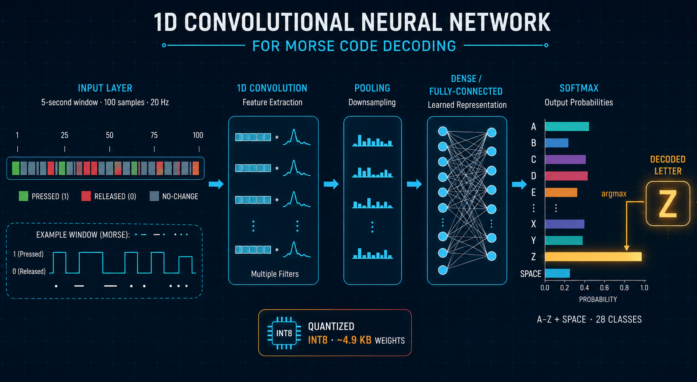
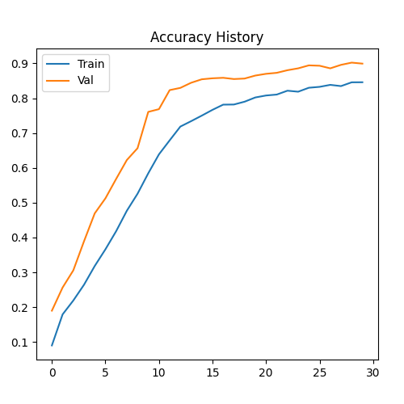
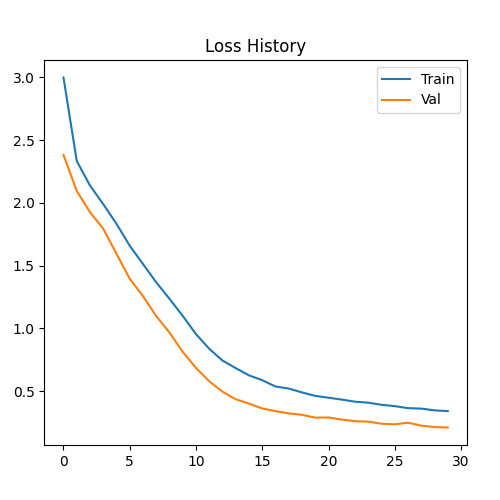

# Comprehensive AI Model Documentation

*Model overview: a 5-second window of 100 button-state samples (20 Hz) flows through stacked 1D convolution, pooling and dense layers, ending in a 28-class softmax (A–Z + SPACE). An argmax selects the decoded character. The whole network is quantized to INT8 (~4.9 KB of weights).*

## 1. Theoretical Architecture Rationale
The model is a specialized **1D Convolutional Neural Network (CNN)**. In the context of TinyML for the STM32F401, this architecture was chosen for its deterministic memory footprint and efficient execution.

### CNN vs. RNN for Embedded Morse Decoding
- **RNN/LSTM**: While Morse is a sequence, LSTMs require high-precision hidden states to be stored for every timestamp (100 samples). This leads to peak RAM usage that often exceeds 96KB when implementing the X-CUBE-AI wrapper.
- **1D-CNN**: Operates by sliding fixed-weight filters. This allows the compiler to reuse memory buffers and utilize **SIMD instructions** available on the ARM Cortex-M4F (Cmsis-NN), making inference significantly faster and lighter.

## 2. Structural Breakdown & Feature Engineering

### The Input Layer (100, 1)
Represents a 5-second buffer at 20Hz. The model views the world as a binary image of a button's history.

### Feature Extraction (Conv1D Layers)
- **Layer 1 (16 Filters)**: These filters act as 'Primitive Feature Detectors'. They look for small 5-sample patterns: a rising edge (0 to 1) or a steady 'On' state. This determines the base duration of a 'tick'.
- **Layer 2 (32 Filters)**: These are 'Complex Pattern Detectors'. By combining signals from Layer 1, they detect high-level structures like 'Three dots followed by a dash' (the letter V).

### The Sparsity Advantage (ReLU & GAP)
- **ReLU Activation**: Introduces non-linearity and 'sparsity' (turning negative values to zero). This allows the model to ignore noise and focus only on the button activity.
- **GlobalAveragePooling (GAP)**: This is the most efficient reduction method. It calculates the average signal of each filter across the entire 5 seconds. This makes the model **Position Independent**; it doesn't matter if you pressed the button at second 1 or second 4.

## 3. Training Strategy & Data Robustness
To ensure the model works for different users, the training data included:
- **Temporal Jitter**: A 'Dot' wasn't always 2 ticks; it could be 1 or 3. This mimics human error.
- **Debounce Spikes**: Random 50ms 'On' signals were added to the idle data to teach the model to ignore mechanical switch noise.
- **Shift Invariance**: Samples were randomly placed within the 100-sample window so the model learns to wait for a full character to complete.

## 4. Performance Visualizations
### Learning Convergence

*Stable validation accuracy indicates the model has learned the 'rules' of Morse code rather than just memorizing the synthetic dataset.*

### Optimization Progress

## 5. Deployment Constraints
- **Params**: 4,668 (fits easily in 512KB Flash).
- **Quantization**: INT8 (Using Post-Training Quantization).
- **Weights (Flash)**: 4,992 bytes (`AI_NETWORK_DATA_WEIGHTS_SIZE`), linked from `network_data.c`.
- **Activations (RAM)**: 8,352 bytes (`AI_NETWORK_DATA_ACTIVATIONS_SIZE`) — a single 4-byte-aligned scratch buffer supplied by the application.
- **I/O**: input `(100, 1)` S8 = 100 bytes; output 28 S8 = 28 bytes.
- **Peak RAM**: <10KB for inference buffers, leaving 80KB+ for your main application logic.
